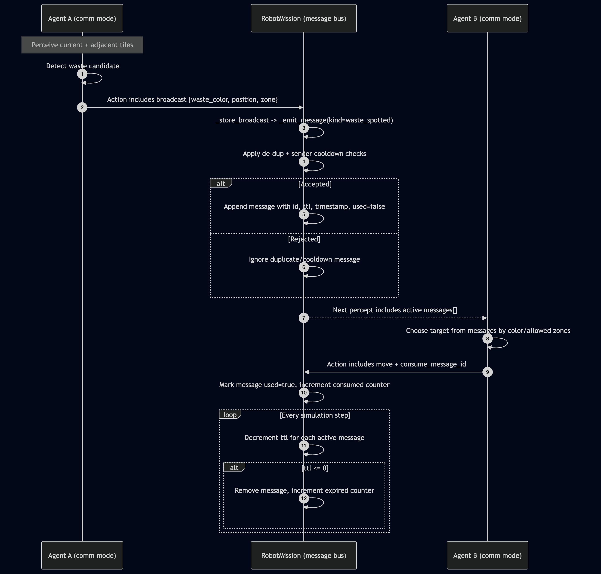

# MAS Project 13 - Robot Mission 2026

Multi-agent simulation where robots cooperatively transform and dispose waste across three zones:

- z1: green waste source
- z2: intermediate processing area
- z3: red-waste disposal area

The objective is to maximize disposed red waste while minimizing remaining waste, runtime, and communication overhead.

## Quick Start

Install dependencies:

```bash
pip install mesa solara matplotlib pandas
```

Run the UI:

```bash
python run.py
```

Then open the Solara URL and click RESET after changing parameters.

## Core Behavior

- GreenAgent (z1 only): picks green, transforms 2 green -> 1 yellow, drops yellow near z1->z2 frontier.
- YellowAgent (z1-z2): picks yellow, transforms 2 yellow -> 1 red, drops red near z2->z3 frontier.
- RedAgent (z1-z3): picks red, transports to disposal zone in far-east column, disposes red.

## Strategies

- random_no_comm (strategy 0): random moves, no messaging.
- memory_no_comm (strategy 10): local/adjacent targeting bias, no messaging.
- comm (strategy 20): message sharing enabled.

Internally, aliases 1->memory_no_comm and 2->comm are also accepted.

## Communication Protocol

Messages are model-level broadcast records with TTL.

Message fields:

- id
- performative (inform)
- sender
- receivers (broadcast)
- content: waste_color, position, zone, kind
- timestamp
- ttl
- used (consumption flag)

Protocol rules:

- Producers: robots in comm mode broadcast locally observed waste (current tile or adjacent tile).
- Kinds: waste_spotted (from local detection), dropped_waste (when red is put down outside disposal).
- De-duplication: identical active messages are suppressed.
- Cooldown: repeated sender/position/color/kind broadcasts are rate-limited.
- Consumption: a robot may attach consume_message_id when selecting a target from messages.
- Expiration: ttl decreases each step; expired messages are removed and counted.

### Sequence Diagram (Agent Communication)



## Metrics Collected

- Waste state: Total Waste, Green Waste, Yellow Waste, Red Waste, Waste In Robots
- Progress: Disposed Red Waste, Cleanup Time (step), Objective Score
- Communication: Messages Sent, Messages Expired, Messages Consumed, Active Messages

Objective Score:

score = 100 * disposed_red_waste - 10 * remaining_waste - current_step - 0.2 * messages_sent

## Batch Experiments

Run reproducible benchmarks:

```bash
python experiments.py --runs 20 --steps 500 --output results/strategy_benchmark.csv
```

Output CSV contains per-run metrics for each strategy.
