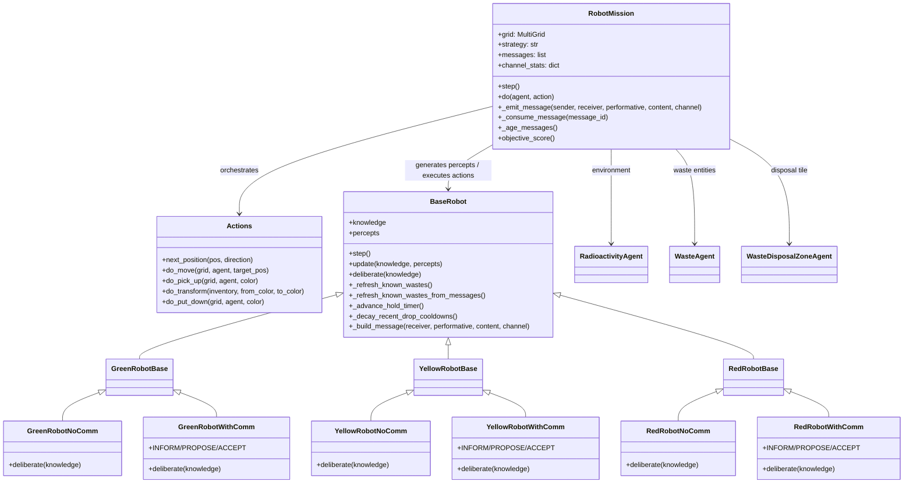
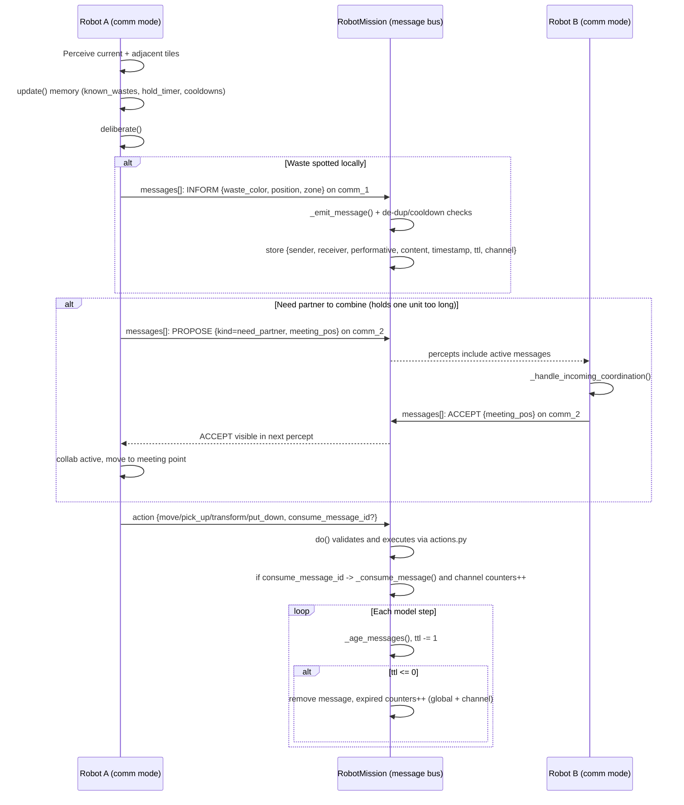
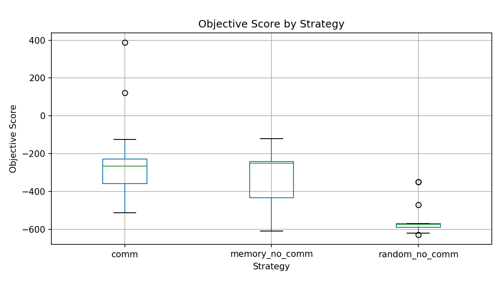
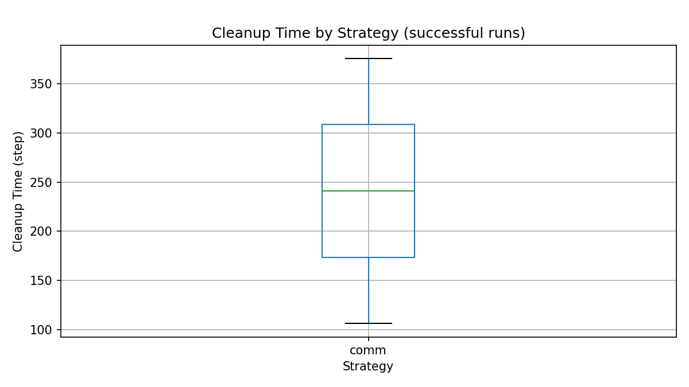
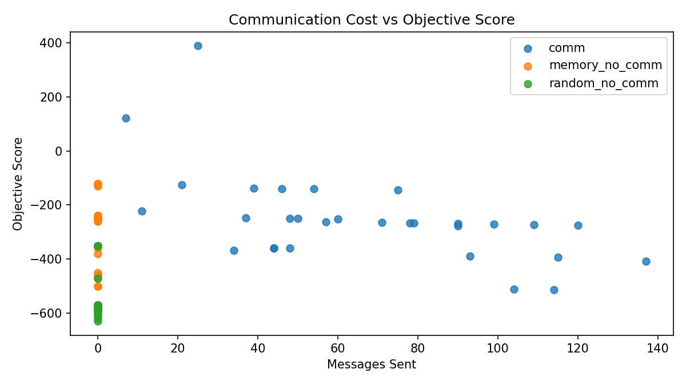
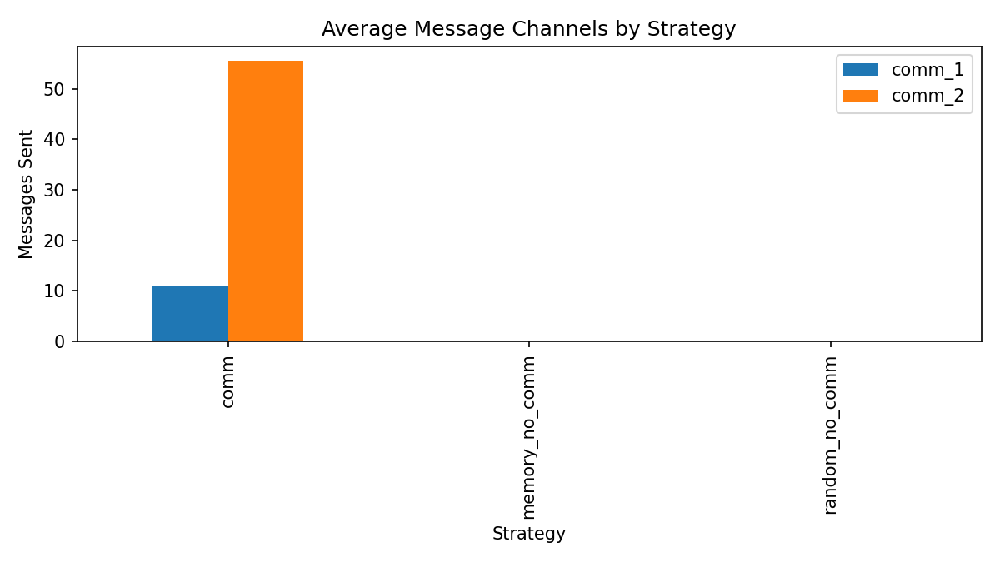

# MAS Project 13 - Robot Mission 2026

Multi-agent simulation (Mesa + Solara) for waste collection and transformation in a 3-zone hostile environment.

## Objective

Maximize red waste disposed in the black disposal tile (z3), while minimizing:

- cleanup time
- remaining waste
- communication cost

Objective score:

`score = 100 * disposed_red_waste - 10 * remaining_waste - current_step - 0.2 * messages_sent`

## Zones and Roles

- `z1` (green): source of green waste
- `z2` (yellow): intermediate processing area
- `z3` (red): most hostile area + final disposal tile

Robot roles:

- `GreenRobot*`: collects `green`, transforms `2 green -> 1 yellow`, drops near `z1 -> z2` border.
- `YellowRobot*`: collects `yellow`, transforms `2 yellow -> 1 red`, drops near `z2 -> z3` border.
- `RedRobot*`: collects `red` and transports it to the black disposal tile.

## Refactored Architecture

- `model.py`: global orchestration, action validation, environment, metrics, datacollector.
- `actions.py`: action primitives (`move`, `pick_up`, `transform`, `put_down`).
- `agents_base.py`: local memory, perception update, navigation helpers, anti-deadlock helpers.
- `agents_no_comm.py`: no-communication logic (random/memory + anti-deadlock).
- `agents_with_comm.py`: communication logic with explicit protocol.
- `experiments.py`: batch experiments and CSV export.
- `analyze_results.py`: automated CSV analysis and plot generation.

### Architecture Diagram:



## Strategies

- `0` / `random_no_comm`: random moves, no messages.
- `10` / `memory_no_comm`: no messages, but local memory guided movement.
- `20` / `comm`: communication enabled.

## Communication Protocol

Structured message fields:

- `sender`
- `receiver` (`broadcast`, team, or specific agent)
- `performative` (`INFORM`, `PROPOSE`, `ACCEPT`)
- `content`
- `timestamp`
- `ttl`
- `channel` (`comm_1`, `comm_2`)

Channels:

- `comm_1`: environment information (`INFORM`, e.g. waste spotted)
- `comm_2`: coordination (`PROPOSE`, `ACCEPT`)

### Protocol Sequence:



## Anti-Deadlock in No-Comm

Agent memory includes:

- `hold_timer` per waste type
- `held_origin`
- `recent_drop_pos` with cooldown

Rules:

- if a robot holds one waste too long, it drops at origin or border
- immediate re-pick at the same tile is blocked during cooldown

## Installation

```bash
pip install mesa solara matplotlib pandas
```

## Run UI

```bash
python run.py
```

Then open the Solara URL (usually `http://localhost:8765`).

When you change sliders, click `RESET` so the model is rebuilt with the new parameters.

## Batch Experiments

```bash
python experiments.py --runs 20 --steps 500 --output results/strategy_benchmark.csv
```

CSV includes:

- performance (`cleanup_time_step`, `objective_score`, `disposed_red_waste`)
- total communication (`messages_sent`, `messages_expired`, `messages_consumed`)
- per-channel communication (`comm_1_*`, `comm_2_*`)

## Analyze CSV + Plots

```bash
python analyze_results.py --input results/strategy_benchmark.csv --output-dir results/analysis
```

Generated outputs:

- `summary_by_strategy.csv` (mean/std + termination rate)
- `objective_boxplot.png`
- `cleanup_boxplot.png` (generated only if at least one run reaches cleanup)
- `messages_vs_score.png`
- `channel_breakdown.png`

## Benchmark Results (2026-04-03)

The following benchmark was executed on April 3, 2026 with:

- `runs=30` per strategy (total: 90 runs)
- `max_steps=500`
- `width=15`, `height=10`
- `initial_green_wastes=20`
- `num_green_robots=4`, `num_yellow_robots=3`, `num_red_robots=2`
- `message_ttl=10`

Source files:

- `results/strategy_benchmark.csv`
- `results/analysis/summary_by_strategy.csv`

### Aggregated Results (mean +/- std)

| Strategy | Runs | Termination Rate (%) | Cleanup Time Mean | Objective Mean +/- Std | Disposed Red Mean +/- Std | Messages Sent Mean +/- Std | Comm 1 Sent Mean | Comm 2 Sent Mean |
|---|---:|---:|---:|---:|---:|---:|---:|---:|
| `random_no_comm` | 30 | 0.0 | -1.0 | -563.67 +/- 63.60 | 0.17 +/- 0.53 | 0.00 +/- 0.00 | 0.00 | 0.00 |
| `memory_no_comm` | 30 | 0.0 | -1.0 | -311.67 +/- 134.96 | 2.43 +/- 1.17 | 0.00 +/- 0.00 | 0.00 | 0.00 |
| `comm` | 30 | 6.67 | 15.13 | -249.06 +/- 172.78 | 2.93 +/- 0.98 | 66.63 +/- 34.58 | 11.07 | 55.57 |

### Interpretation

- `comm` now gives the best objective on average (`-249.06`) after reducing `comm_2` spam.
- `comm` is the only strategy with successful cleanups in this setup (`6.67%` of runs).
- `memory_no_comm` remains competitive and message-free, but does not fully clean within 500 steps.
- `comm_2` is still the dominant communication channel, but now at a manageable level.

### Generated Figures

#### Objective Score Distribution


Description: This boxplot compares the score distribution for each strategy over 30 runs.
Interpretation: `comm` has the best median score, `memory_no_comm` is second, and `random_no_comm` is the weakest baseline.

#### Cleanup Time (Successful Runs)


Description: This plot shows cleanup time only for successful runs where all waste was cleaned.
Interpretation: Only `comm` produced successful cleanups in this benchmark, with variable completion times.

#### Communication Cost vs Objective


Description: Each point is one run, with total messages on x-axis and objective score on y-axis.
Interpretation: High message volume is no longer extreme, and many `comm` runs achieve better scores than no-communication baselines.

#### Communication Channel Breakdown


Description: Mean number of messages sent per channel (`comm_1`, `comm_2`) by strategy.
Interpretation: `comm_2` is the main coordination channel, while staying in a range compatible with the final project objective.

## Conceptual Choices

- clear perception / decision / action separation
- distributed agents with local view and bounded memory
- explicit comparison of no-comm vs comm strategies
- quantified trade-off between coordination gains and message overhead
